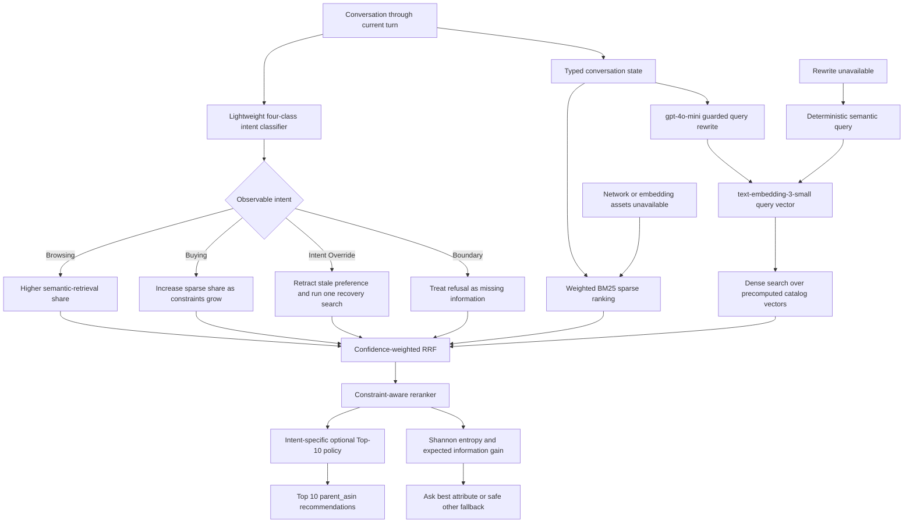

# TechJam Conversational E-Commerce Search Challenge

Build an AI shopping agent that asks useful follow-up questions and recommends the customer's hidden target product within at most 10 turns.

## What You Receive

- A frozen catalog of 50,000 products from the `Clothing_Shoes_and_Jewelry` category of Amazon Reviews 2023.
- 200 labeled public sessions for local development.
- A weak BM25 starter agent and deterministic local evaluator.
- The Agent API contract and scoring rules.

The organizer keeps 800 additional sessions private for final evaluation.

## Task

For each session, your agent receives an anonymized preference profile and a short customer message. Raw user IDs, review text, timestamps, and purchase history are never disclosed. On every turn the agent may:

- ask a natural clarification question in `message` and identify one requested field in `ask_attribute`;
- return a ranked list of up to 10 catalog `parent_asin` values;
- do both in the same response.

The session ends when the target product appears in the scored Top 10 or after turn 10. Sessions cover Buying, Browsing, Intent Override, and Boundary behavior.

## Intent-Aware Retrieval Pipeline



The measured production fallback remains sparse-only BM25, constraint
reranking, and the fixed `other` question policy. Intent routing, entropy-based
questions, and intent-specific Top-10 diversification are opt-in demonstration
features because they have not yet exceeded the sparse-only TechnicalScore.

## Download the Catalog

Download `catalog.jsonl.gz` from the GitHub Release attached to this repository, then run:

```bash
gzip -dk catalog.jsonl.gz
mv catalog.jsonl data/catalog.jsonl
```

Verify the downloaded file using the published `SHA256SUMS` file.

## Run the Starter

Python 3.10 or later is recommended. The starter uses only the Python standard library.

```bash
python3 -m evaluator.local_evaluator
```

Edit `starter/agent.py` to implement your system. Do not edit the evaluator or public labels when reporting your local score.
The command writes per-session results and aggregate metrics to `results.json`.

The included weak BM25 starter scores Hit Rate@10 `0.125`, MRR `0.068034`, and
MTTC `9.81` on the released public set. See `docs/baseline_results.json`.

## Agent Interface

```python
class Agent:
    def reset(self, session_id: str, user_profile: dict) -> None:
        ...

    def respond(self, session_id: str, user_message: str, turn: int, top_k: int) -> dict:
        return {
            "message": "Do you have a material preference?",
            "ask_attribute": "material",
            "recommendations": [
                {"parent_asin": "B000..."},
                {"parent_asin": "B001..."}
            ],
            "usage": {"prompt_tokens": 120, "completion_tokens": 30}
        }
```

`ask_attribute` is one of `category`, `material`, `color`, `size`, `style`, `brand`, `budget`, `feature`, `use_case`, `other`, or `null`. See `docs/agent_api_contract.json`.

## Technical Metrics

- **Hit Rate@10:** fraction of sessions that find the target within 10 turns.
- **MRR:** mean reciprocal rank of the target; a miss contributes zero.
- **MTTC:** mean first-hit turn; a miss is assigned turn 11.
- **Reported token usage:** prompt and completion tokens returned by the team's model client.

```text
TechnicalScore = 0.50 × HitRate@10 + 0.30 × MRR + 0.20 × Efficiency
Efficiency = clip((11 - MTTC) / 10, 0, 1)
```

`TechnicalScore` is an objective input to the `Technical Execution` assessment. It is not a separate judging criterion and does not represent the entire `Technical Execution` score.

Only exact `parent_asin` equality produces a hit. Core metrics are also reported by scenario.

## Model Choice and Cost

Teams may use any legally accessible LLM API or local model. Teams manage their own credentials and must never commit API keys. Model choice, estimated cost, token usage, and latency must be disclosed. Token usage is a feasibility metric, not part of the core technical score. The organizer does not provide or reimburse model API credits; teams are responsible for any costs incurred through optional external services.

## Optional Hybrid Retrieval Experiment

The hybrid path combines weighted BM25 and OpenAI dense retrieval with weighted
reciprocal-rank fusion, then applies the existing constraint reranker. It uses
`gpt-4o-mini` to rewrite active typed constraints into a compact semantic
query and `text-embedding-3-small` at 256 dimensions for catalog/query
embeddings. Both models and all fusion settings are configurable.

```bash
python3.11 -m venv .venv
.venv/bin/pip install -r requirements-hybrid.txt
export OPENAI_API_KEY="..."

# Resumable one-time precomputation for the 50k frozen catalog.
.venv/bin/python -m tools.build_catalog_embeddings

# Evaluate several sparse:dense RRF weight pairs.
.venv/bin/python -m tools.run_hybrid_ablation

# Compare dense weights that decrease as constraints/attributes accumulate.
.venv/bin/python -m tools.run_adaptive_hybrid_ablation
```

Generated matrices, query caches, and ablation outputs are written under
`artifacts/` and ignored by git. The standard `AgentConfig` keeps hybrid search
disabled unless explicitly selected, so the original offline pipeline remains
the fallback when dependencies, credentials, embedding assets, or network
access are unavailable. Official scoring may disable network access; a final
submission must either package the required local assets and permit query
embedding calls or use the documented offline fallback.

## BM25 Field-Weight Search

The sparse retriever exposes independent FTS5 weights for `title`, `categories`,
`features`, `details`, `store`, and `description`. A reproducible randomized
grid with successive halving can tune those weights without running the full
200-session evaluator for every candidate:

```bash
.venv/bin/python -m tools.search_bm25_weights
```

The search selects candidates only on a stratified 70% training split and
reports a separate 30% holdout comparison against the default allocation.
Results are written to `artifacts/bm25_weight_search.json`. Keep the default
weights when a training improvement does not also hold up out of sample.

Compare the unchanged global BM25 route with strict category scope and
equal-weight global/category reciprocal-rank fusion using:

```bash
.venv/bin/python -m tools.run_category_retrieval_ablation
```

The output includes per-turn category Top-100 candidate recall and the exact
sessions whose target never enters the scoped candidate pool.

Run the corrected unscored-category comparison—including OR, hard/soft,
per-constraint RRF, and global/category RRF variants—with:

```bash
.venv/bin/python -m tools.run_clean_category_ablation
```

## Optional Learned Question-Policy Experiment

Generate leakage-safe, product-disjoint counterfactual action labels from
catalog targets, then train the small offline NumPy action-value model:

```bash
.venv/bin/python tools/build_question_policy_dataset.py \
  --catalog-samples 5000 \
  --catalog-only \
  --max-states-per-sample 3 \
  --candidate-depth 100 \
  --output artifacts/question_policy_catalog.jsonl

.venv/bin/python tools/train_neural_question_policy.py \
  artifacts/question_policy_catalog.jsonl \
  --output artifacts/question_policy_model.npz \
  --hidden-size 16
```

The builder enumerates every legal `ask_attribute` while keeping target-side
data outside `model_input`. The learned policy is intentionally not enabled in
the default agent: public information gain and a 500-product catalog-only MLP
both lost to `always_other`. See `HISTORY.md` for the results.

## Intent-Aware Hybrid Demonstration

The presentation prototype classifies the intent observable through the current
turn into Browsing, Buying, Intent Override, or Boundary, then routes an
experimental sparse/dense mixture. Train the 34.6 KB NumPy classifier with:

```bash
.venv/bin/python tools/train_intent_classifier.py \
  --output /tmp/techjam_intent_classifier.json \
  --report /tmp/techjam_intent_train_report.json

.venv/bin/python tools/run_intent_hybrid_ablation.py \
  --classifier-model /tmp/techjam_intent_classifier.json \
  --experiments sparse_only,fixed_85_15,intent_router_conservative,intent_router_conservative_topk
```

The implementation also contains a Shannon-entropy question gate and an
intent-specific Top-10 layer. Both remain opt-in: on the public simulator,
`always_other` and sparse-only retrieval still produce the strongest measured
TechnicalScore. See `docs/intent_aware_hybrid_architecture.md` for the complete
architecture, ablations, prompt routing, and presentation narrative.

## Files

```text
data/public_set.jsonl             200 labeled development sessions
docs/competition_specification.md participant rules and evaluation protocol
docs/agent_api_contract.json      machine-readable Agent contract
docs/evaluation_config.json       scoring configuration
docs/baseline_results.json        reproducible weak-starter reference score
starter/agent.py                  editable weak starter
starter/information_gain_policy.py optional catalog-entropy question baseline
starter/intent_classifier.py     tiny observable turn-intent classifier
starter/intent_hybrid_router.py  intent fusion, entropy, and Top-10 policies
starter/neural_question_policy.py optional offline NumPy action-value policy
starter/semantic_query_prompt.py guarded dense-query prompt variants
evaluator/local_evaluator.py      public-set simulator and scorer
tools/build_question_policy_dataset.py product-disjoint counterfactual builder
tools/run_intent_hybrid_ablation.py intent-conditioned retrieval ablation
tools/train_neural_question_policy.py train/evaluate the lightweight policy
```

## Judging and Submission Policy

- Participant submission requirements: `docs/submission_rules.md`
- Organizer-only final judging controls: `organizer/JUDGING_RUNBOOK.md`
- Organizer private release checklist: `organizer/private_release_checklist.md`
- Judging day operations SOP: `organizer/JUDGING_DAY_SOP.md`

## Data Source

The catalog and sessions are derived from Amazon Reviews 2023 by McAuley Lab, UCSD. See `DATA_ATTRIBUTION.md` before using or redistributing the data.
Sessions are sampled deterministically from the official Clothing 5-core leave-last-out split and joined to the frozen catalog.
