# TechJam 2026 Track 4 — Conversational Shopping Copilot

A stateful product-retrieval agent that converts a shopper's evolving language
into typed constraints, retrieves catalog evidence, and returns ranked products
plus a useful clarification. The official score path is deterministic and
offline; local LLM components are optional deployment experiments.

## Result

Measured on all 200 released sessions:

| Hit Rate@10 | MRR | MTTC | TechnicalScore | Model tokens |
|---:|---:|---:|---:|---:|
| **0.970** | **0.664567** | **2.535** | **0.853670** | **0** |

Only `starter.agent.Agent` owns these results. The Qwen/MiniLM deployment path
is implemented but does not have a committed full-agent benchmark score.

## Quick start

Requirements: Python 3.10 or newer. The scored agent uses only the standard
library and needs no API key.

```bash
git clone https://github.com/LiuYuan555/jamming.git
cd jamming
mkdir -p data
curl -L https://github.com/TechJam2026/techjam-conversational-search/releases/latest/download/catalog.jsonl.gz -o catalog.jsonl.gz
gzip -dc catalog.jsonl.gz > data/catalog.jsonl
python3 -m evaluator.local_evaluator
```

The final command evaluates all 200 public sessions, prints aggregate metrics,
and writes detailed output to ignored `results.json`. If the catalog already
exists elsewhere, use:

```bash
python3 -m evaluator.local_evaluator --catalog /path/to/catalog.jsonl
```

### Open the interactive demo

```bash
python3.11 -m venv .venv
.venv/bin/pip install -r requirements-demo.txt
.venv/bin/python -m ui.server --llm
```

The server opens `http://127.0.0.1:8787/`. The first `--llm` start downloads
Qwen2.5-1.5B (about 3.1 GB); later runs use the local cache. Choose the **LLM
fall-through** preset, then open **Details** to see the extraction route, typed
constraints, calls, tokens, rejects, latency, and whether the reply was
generated. Pass `--catalog PATH` if the catalog is outside `data/`.

Run `python3 -m ui.server` instead for the dependency-free deterministic demo.

### Run the tests

```bash
.venv/bin/python -m unittest discover -s tests
```

## Pipeline

```mermaid
flowchart LR
    A[Customer turn + history] --> B[Template and dialogue-act parser]
    A -->|Unmatched free text| C[Qwen constraint extraction]
    C -->|Validated JSON| D[Typed constraint state]
    C -. Rejected or unavailable .-> B
    B --> D

    D --> E[Weighted SQLite FTS5 BM25 Top 100]
    D --> F[Qwen semantic-query rewrite]
    P[Anonymized preference_tags] -->|Weak hints| F
    F --> G[Local MiniLM dense Top 100]
    F -. Rewrite fallback .-> H[Deterministic semantic query]
    H --> G

    A --> I[Observable-intent probabilities]
    E --> K[Constraint-aware reranker]
    E -->|Dense route enabled| J[Weighted reciprocal-rank fusion]
    G --> J
    I --> J
    G -. Assets unavailable .-> E

    J --> K
    K --> L[Top 10 parent_asin]
    K --> M[Shannon information-gain question]
    D --> N[Qwen concise confirmation]
    L --> O[Agent response]
    M --> O
    N --> O
    N -. Rejected or unavailable .-> Q[Protocol-safe deterministic message]
    Q --> O
```



Green/blue coloring in the presentation deck distinguishes the measured score
path from optional deployment intelligence. Logically, the score path is:

```text
parser → typed state → weighted BM25 → constraint reranker → Top 10 + fixed `other` question
```

| Stage | Implementation | Rationale | Status |
|---|---|---|---|
| Understanding | Rules, then grounded Qwen extraction on fall-through | Exact benchmark templates stay lossless; real language gets a robust recovery path | Qwen optional |
| State | Typed active/retracted constraints with turn and source | Corrections are surgical and auditable | Scored |
| Sparse retrieval | Field-weighted SQLite FTS5 BM25 | Preserves exact catalog evidence cheaply | Scored |
| Semantic retrieval | Profile-aware Qwen rewrite + local MiniLM | Recovers paraphrases without paid APIs | Experimental |
| Fusion | Weighted reciprocal-rank fusion | Combines incompatible score scales safely | Experimental |
| Ranking | Attribute-aware exact/overlap/miss scoring | Verifies each constraint in relevant fields | Scored |
| Clarification | Shannon entropy and expected information gain | Asks the attribute expected to remove most uncertainty | Demo only |
| Customer message | Grounded, concise Qwen confirmation | Adds natural language without giving generation control of ranking | Demo only |

## Shannon entropy

For candidate probabilities \(p_i\), uncertainty in bits is:

\[
H(C) = -\sum_i p_i \log_2 p_i
\]

For an attribute \(a\), expected information gain is:

\[
IG(a) = H(C) - \sum_r P(r\mid a)H(C\mid r)
\]

The policy favors attributes that partition plausible products into balanced,
well-covered answer groups, while masking questions already asked or refused.
On the released simulator, information gain scored `0.842358`, below the fixed
`other` policy's `0.853670`, so it remains a diagnostic demonstration rather
than the submission default.

## Optional local models

- `Qwen/Qwen2.5-1.5B-Instruct`: extraction, query rewrite, and customer reply;
  Apache-2.0, approximately 3.1 GB at FP16, no API fee.
- `sentence-transformers/all-MiniLM-L6-v2`: 384-dimensional catalog/query
  embeddings; Apache-2.0 and no per-query fee.

Model weights and dense vectors are not included. Initial download requires
network access. Invalid output, missing libraries, missing assets, or model
failure return control to the deterministic scored path.

## Key files

```text
starter/agent.py                    official scored Agent
starter/conversation_state.py       typed multi-turn state
starter/constraint_reranker.py      evidence-aware reranker
starter/llm_agent.py                optional local-LLM orchestration
starter/local_llm.py                validated extraction/rewrite/reply
starter/local_dense.py              optional MiniLM retriever
evaluator/local_evaluator.py        deterministic public evaluator
ui/                                 local browser demo
docs/techjam_submission_slides.html 1600×900 presentation deck
HISTORY.md                          measured experiment record
SUBMISSION_MANIFEST.md              packaging checklist
```

Open `docs/techjam_submission_slides.html` and use the arrow keys to present or
print one slide per page. See `SUBMISSION_MANIFEST.md` before packaging; catalog
data, virtual environments, caches, generated results, and model artifacts must
not be submitted.

The catalog is derived from Amazon Reviews 2023 by McAuley Lab, UCSD. See
`DATA_ATTRIBUTION.md` for attribution.
