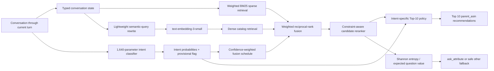

# Intent-aware hybrid shopping retrieval

## Executive decision

The project now has two explicit operating modes:

1. **Score mode:** keep the measured winner, sparse-first retrieval with the
   fixed `other` clarification policy.
2. **Intent-aware demonstration mode:** classify the observable turn intent,
   route a conservative sparse/dense mixture, choose an intent-specific dense
   rewrite prompt, and expose Shannon information gain as an auditable question
   diagnostic.

The second mode is presentation-ready and fully testable, but it is not yet the
score-maximizing default. On the public set, intent routing improves time to
first hit slightly but loses more MRR than it gains in speed.

## System flow



## 1. Observable intent classifier

The four outputs are **turn intents**, not guesses about hidden future events:

| Output | Observable meaning | Retrieval response |
|---|---|---|
| Browsing | Vague/exploratory request with no concrete clarification yet | Relatively more semantic recall and optional diversity |
| Buying | At least one concrete active requirement | Increasingly sparse/exact retrieval as constraints accumulate |
| Intent Override | An explicit correction or retraction has appeared | Remove stale preference, run one recovery retrieval, then decay toward sparse |
| Boundary | The customer delegates/refuses an attribute decision | Do not add a negative constraint; avoid repeating the refused attribute |

The classifier is multinomial logistic regression over deterministic hashed
unigrams/bigrams, message-history features, and asked-attribute history. The
prototype has 1,640 parameters, a 34.6 KB artifact, and requires only NumPy.

Training uses 16,000 turns generated from 1,000 non-public catalog products,
with product-disjoint train/validation/test splits. On the public simulator it
achieves 100% observable-label accuracy, but only 67.125% against hidden session
scenario labels. This gap is expected: Boundary is identical to Browsing before
the refusal, and Intent Override is unknowable before the correction.

The runtime output includes a four-way probability distribution and a
`provisional` flag. Retrieval consumes the probabilities rather than making an
unsafe hard switch.

## 2. Intent-conditioned hybrid retrieval

Sparse and dense rankings are combined by weighted reciprocal-rank fusion.
The evidence-calibrated presentation schedule uses the following **dense**
weights; sparse weight is `1 - dense`:

| Observable state | 1 constraint | 2 constraints | 3 constraints | 4+ constraints |
|---|---:|---:|---:|---:|
| Browsing | 0.20 | 0.15 | 0.10 | 0.05 |
| Buying | 0.10 | 0.05 | 0.00 | 0.00 |
| Boundary | 0.10 | 0.05 | 0.05 | 0.05 |

Intent Override uses dense weights `0.20 → 0.10 → 0.00` over the first three
turns after an observed correction. This gives semantic retrieval one recovery
opportunity after the state reset, then returns to exact matching.

For uncertain predictions, the final dense weight is blended toward the safe
fixed 0.15 baseline rather than switching abruptly.

### Measured public result

| Retrieval policy | Hit@10 | MRR | MTTC | TechnicalScore |
|---|---:|---:|---:|---:|
| **Sparse-only** | **0.970** | **0.664567** | 2.535 | **0.853670** |
| Fixed 85/15 | 0.970 | 0.657446 | **2.510** | 0.852034 |
| Conservative router + trained classifier + v2 prompt | 0.970 | 0.646954 | 2.515 | 0.848786 |
| Conservative router + entropy questions | 0.960 | 0.604883 | 2.700 | 0.827465 |

Intent routing finds some targets earlier, but the dense route perturbs exact
catalog ranking and reduces MRR. Keep it experimental until a held-out split
shows a net TechnicalScore gain.

## 3. Dense-query rewrite

The rewrite has one narrow job: convert already-parsed active constraints into
a compact catalog-like query. It must not decide intent, choose products, or
invent attributes.

Recommended components:

- Rewrite: `gpt-4o-mini`
- Embedding: `text-embedding-3-small`, 256 dimensions
- Catalog vectors: precomputed once for all 50,000 products
- Runtime cache key: prompt version + model + canonical active constraints
- Offline fallback: deterministic labelled constraint string

Two prompt styles survived a balanced 120-state screen:

| Rewrite | Dense R@10 | Dense R@100 | Dense MRR | Best use |
|---|---:|---:|---:|---|
| `natural_description` | 0.283333 | **0.583333** | 0.182052 | Candidate recall; Buying and vague Browsing |
| `catalog_phrase` | **0.308333** | 0.550000 | **0.204654** | Early rank; Boundary and precise Browsing |
| Deterministic | **0.308333** | 0.541667 | 0.190693 | Offline and exact-value fallback |

The runtime now uses the tested v2 prompt and sanitizer. The presentation
router is:

- Browsing: `natural_description` when recall is the objective; otherwise
  `catalog_phrase` for early rank.
- Buying: `natural_description`, fused at a low weight with exact BM25.
- Intent Override: `natural_description` for one recovery turn, with
  deterministic fallback.
- Boundary: `catalog_phrase`, because no new preference should be invented.

The prompt sanitizer preserves at least one anchor token from every explicit
constraint, rejects invented negation, removes model formatting, and enforces a
48-word/360-character limit. A prompt bug discovered during testing treated
`hard: false` as an unwanted preference; version 2 no longer sends that control
field to the rewrite model.

## 4. Shannon entropy before asking an attribute

For the current Top-K candidate probabilities `p_i`, uncertainty is:

```text
H(C) = -sum_i p_i log2(p_i)
```

For each possible attribute question `a`, candidates are partitioned by the
reply they would produce. Expected information gain is:

```text
IG(a) = H(C) - sum_r P(r | a) H(C | r)

question_value(a) = normalized_IG(a) * answer_coverage(a)^0.5
```

Repeated, refused, and zero-coverage attributes are masked. `other` is evaluated
using its actual wildcard behavior, not treated as a normal named field.

On the released simulator this gate should remain diagnostic. Named entropy
questions lower TechnicalScore because `other` can reveal two constraints of
any type. In a real system with ordinary question semantics, the same entropy
calculation becomes much more meaningful.

## 5. Intent-specific Top-10 behavior

| Intent | Top-10 policy |
|---|---|
| Browsing | Light diversity across product subtype, store, and salient attributes; preserve a strong relevance floor |
| Buying | Exact-constraint reranking; hard requirements dominate, with sparse rank as a strong prior |
| Intent Override | Rebuild from active post-retraction constraints only; penalize evidence tied solely to the removed preference |
| Boundary | Treat refusal as missing information, not negation; retain broad category relevance and avoid repeated questioning |

Diversification must be an opt-in reranking layer because the evaluator rewards
the exact target's reciprocal rank, not catalog coverage.

The opt-in implementation requests a reranked pool of 30 and then emits ten
products. Buying preserves the existing order; Browsing pins rank one and uses
a small metadata-diversity penalty; Override reranks from active post-retraction
constraints; Boundary uses category evidence only.

| Retrieval policy | Hit@10 | MRR | MTTC | TechnicalScore |
|---|---:|---:|---:|---:|
| Conservative v2 router | 0.970 | 0.646954 | 2.515 | 0.848786 |
| Conservative v2 router + intent Top-10 | 0.970 | 0.641808 | 2.515 | 0.847242 |

Browsing diversity was neutral in the final comparison. Most of the total
regression came from Boundary's deliberately broad category-only ordering. The
layer is useful for a product demo, but not as a scoring default.

## 6. External training data

U-NEED, E-ConvRec, SIMMC 2.0, and MultiWOZ can provide shopping language,
dialogue acts, corrections, refusals, and slot-state variation. None directly
contains the four TechJam turn labels. The defensible workflow is:

1. freeze the observable label guide;
2. relabel complete external conversation prefixes;
3. use external data as out-of-domain evaluation first;
4. train on it only after inter-annotator agreement and licence checks;
5. retain a TechJam product-disjoint test set.

## Presentation narrative

1. **Problem:** product search changes as customer intent becomes more concrete.
2. **State:** typed constraints preserve requirements and explicit corrections.
3. **Intent:** a 34.6 KB classifier emits calibrated, provisional probabilities.
4. **Retrieval:** BM25 protects exact evidence; dense retrieval adds semantic recall.
5. **Routing:** intent and information count control the sparse/dense mixture.
6. **Questioning:** Shannon entropy estimates which answer would reduce uncertainty.
7. **Safety:** no hidden target features, no invented constraints, cached API calls,
   and a complete offline fallback.
8. **Evidence:** the architecture works, but sparse-only remains the benchmark
   winner; this is presented as a measured finding rather than concealed.

## Remaining considerations

- Evaluate on manually paraphrased/OOD messages before claiming real-language
  classifier accuracy.
- Do not present Boundary or future Override as predictable before evidence.
- Tune routing on a locked product-disjoint set, never the 200 public sessions
  alone.
- Report classifier calibration, per-intent retrieval metrics, latency, API
  token cost, and fallback rate.
- Official scoring may disable network access; package the classifier and
  deterministic rewrite fallback locally.
- Keep `always_other` and sparse-only as the production fallback until the
  complete intent-aware system improves TechnicalScore out of sample.
